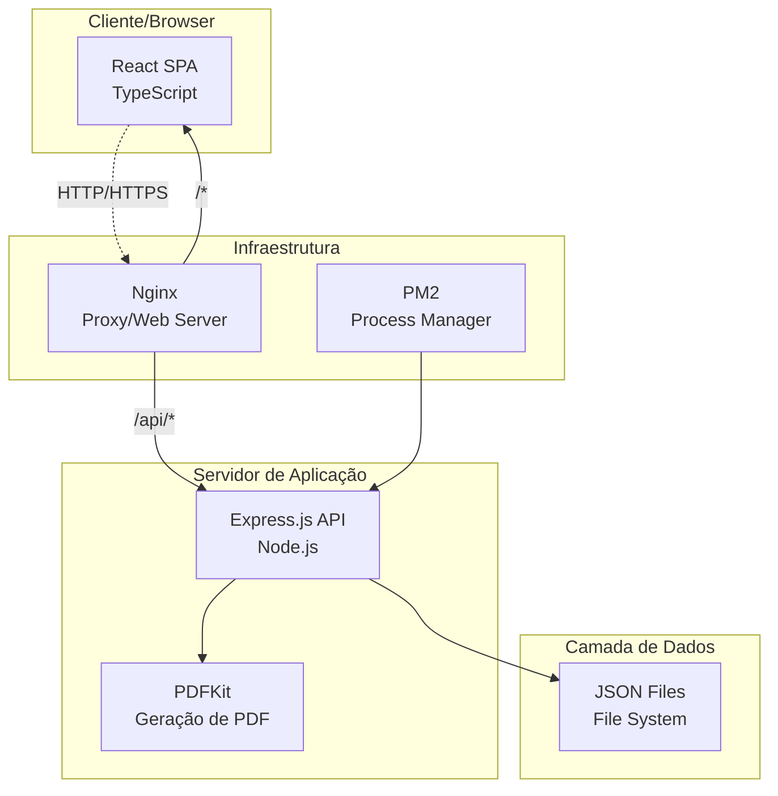
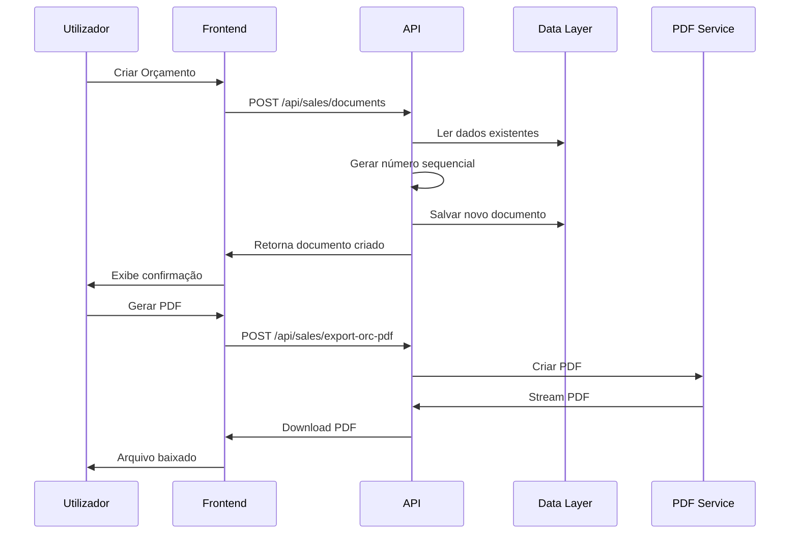
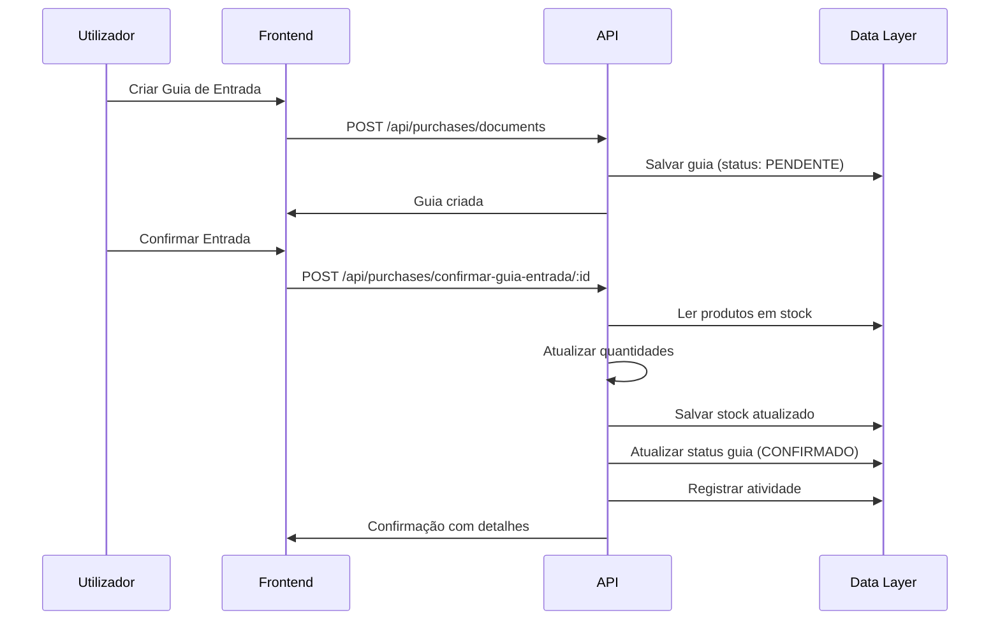
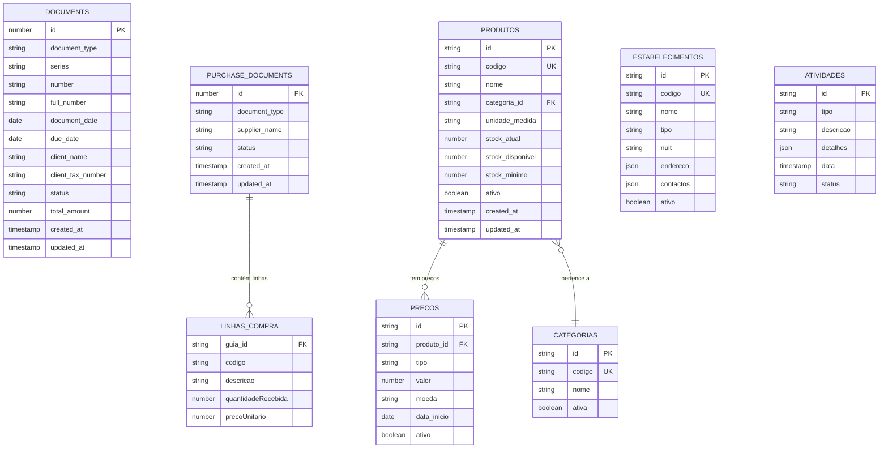
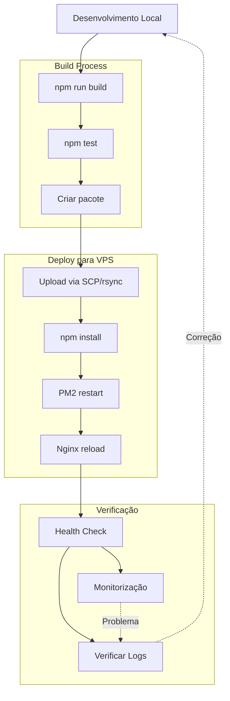
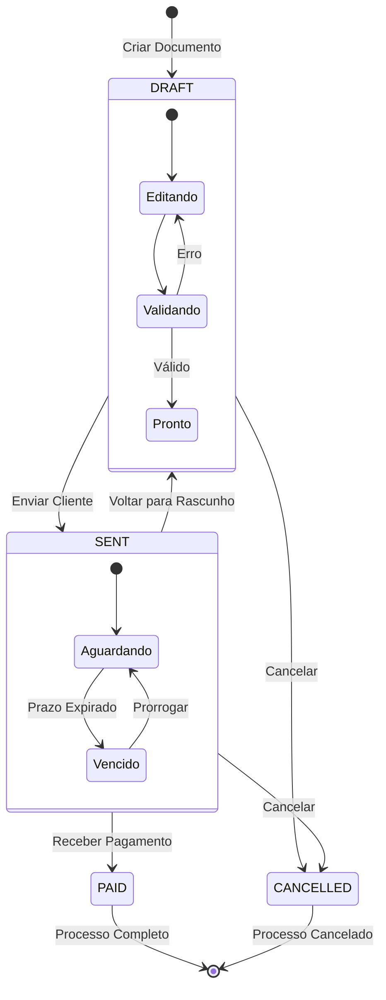
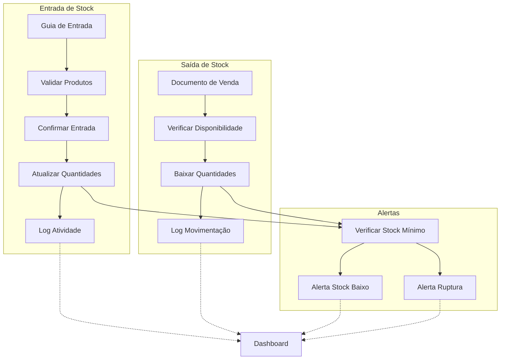
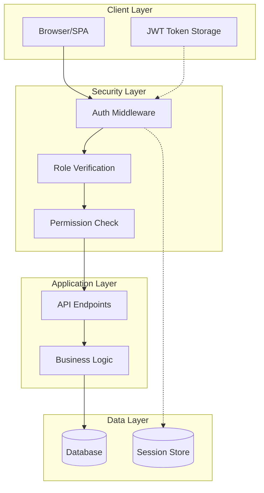
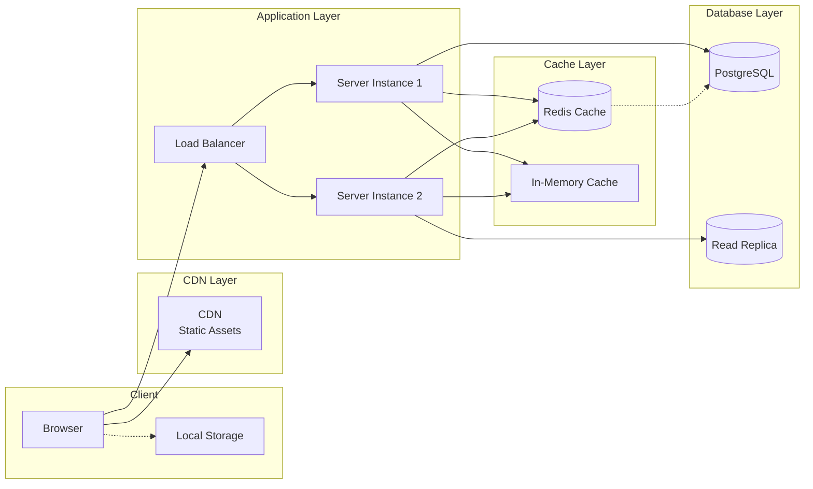
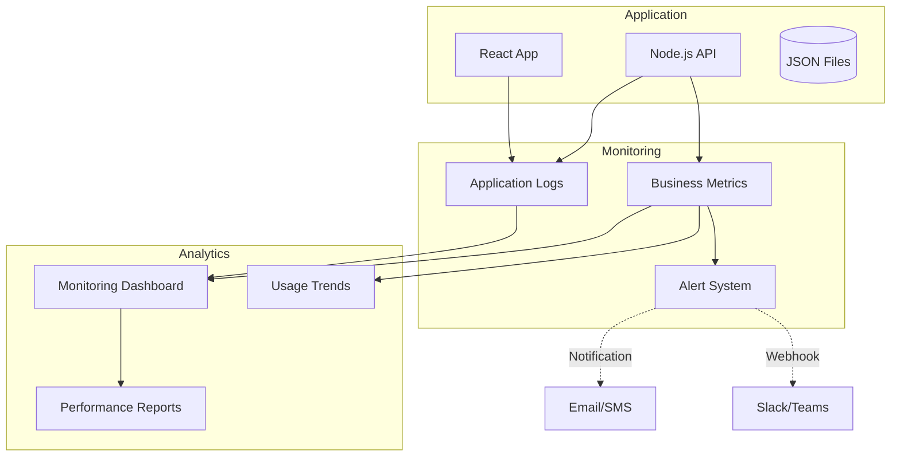

# Diagramas Técnicos - Sistema USIMAMIZI

Este documento complementa o Software Design Document (SDD) com diagramas técnicos da arquitetura do sistema.

## 1. Arquitetura Geral



## 2. Fluxo de Dados - Vendas



## 3. Fluxo de Stock - Compras



## 4. Estrutura de Componentes Frontend

```mermaid
graph TD
    App[App.tsx<br/>Router Principal]
    
    subgraph "Layout"
        Layout[Layout.tsx<br/>Sidebar + Header]
        Sidebar[Sidebar<br/>Menu Navegação]
        Header[Header<br/>Ações Globais]
    end
    
    subgraph "Páginas"
        Dashboard[Dashboard.tsx<br/>KPIs + Gráficos]
        Vendas[Vendas.tsx<br/>Gestão Documentos]
        Compras[Compras.tsx<br/>Guias + Fornecedores]
        Faturas[Faturas.tsx<br/>Faturação]
        Definicoes[Definicoes.tsx<br/>Configurações]
    end
    
    subgraph "Hooks"
        useAuth[useAuth.tsx<br/>Autenticação]
    end
    
    subgraph "Services"
        API[api.ts<br/>Cliente HTTP]
        Config[config/api.ts<br/>Endpoints]
    end
    
    App --> Layout
    Layout --> Sidebar
    Layout --> Header
    Layout --> Dashboard
    Layout --> Vendas
    Layout --> Compras
    Layout --> Faturas
    Layout --> Definicoes
    
    Dashboard --> useAuth
    Vendas --> useAuth
    Compras --> useAuth
    
    Dashboard --> API
    Vendas --> API
    Compras --> API
    
    API --> Config
```

## 5. Arquitetura de APIs

```mermaid
graph LR
    subgraph "Frontend Requests"
        GET[GET Requests]
        POST[POST Requests]
        PUT[PUT Requests]
        DELETE[DELETE Requests]
    end
    
    subgraph "API Middleware"
        CORS[CORS Policy]
        Parser[Body Parser]
        Logger[Request Logger]
    end
    
    subgraph "Route Handlers"
        Sales[/api/sales/*<br/>Vendas]
        Purchases[/api/purchases/*<br/>Compras]
        Dashboard[/api/dashboard/*<br/>KPIs]
        Settings[/api/settings/*<br/>Configurações]
        Health[/api/health<br/>Status]
    end
    
    subgraph "Business Logic"
        DocGen[Document Generation]
        StockMgmt[Stock Management]
        PDFGen[PDF Generation]
        DataValidation[Data Validation]
    end
    
    subgraph "Data Operations"
        ReadData[readData()]
        WriteData[writeData()]
        FileOps[File Operations]
    end
    
    GET --> CORS
    POST --> CORS
    PUT --> CORS
    DELETE --> CORS
    
    CORS --> Parser
    Parser --> Logger
    
    Logger --> Sales
    Logger --> Purchases
    Logger --> Dashboard
    Logger --> Settings
    Logger --> Health
    
    Sales --> DocGen
    Sales --> PDFGen
    Purchases --> StockMgmt
    Dashboard --> DataValidation
    
    DocGen --> ReadData
    DocGen --> WriteData
    StockMgmt --> ReadData
    StockMgmt --> WriteData
    
    ReadData --> FileOps
    WriteData --> FileOps
```

## 6. Modelo de Dados



## 7. Fluxo de Deploy



## 8. Estados de Documentos



## 9. Fluxo de Stock



## 10. Arquitetura de Segurança (Futura)



## 11. Performance e Caching (Futuro)



## 12. Monitorização e Observabilidade



---

## Como visualizar os diagramas

Os diagramas neste documento estão em formato Mermaid. Para visualizá-los:

1. **GitHub/GitLab**: Renderização automática
2. **VS Code**: Extensão "Mermaid Preview"
3. **Online**: [mermaid.live](https://mermaid.live)
4. **Documentação**: Integração com GitBook, Notion, etc.

---

**Sistema USIMAMIZI - Diagramas Técnicos**  
**© 2025 Pallas Consultoria e Serviços Lda**